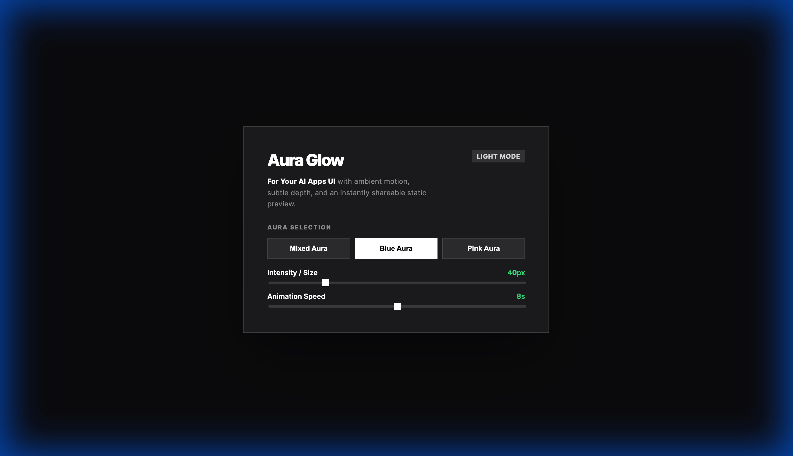

# Aura Glow

A lightweight static HTML showcase for ambient aura effects in modern product interfaces.



## Overview

Aura Glow is a single-file UI experiment designed to create a polished, shareable visual layer for interface concepts and landing page moments.

It includes:

- Multiple aura modes
- Adjustable glow intensity
- Adjustable animation speed
- Light and dark presentation modes
- Static deployment support through GitHub Pages

## Live preview on GitHub

This repository is configured for GitHub Pages using a custom GitHub Actions workflow.

To publish it:

1. Push the repository to GitHub
2. Open `Settings -> Pages`
3. Under `Build and deployment`, set `Source` to `GitHub Actions`
4. Push to `main` or run the workflow manually from the `Actions` tab

Once enabled, GitHub will publish the static site from this repository.

## Local usage

Open `index.html` directly in your browser.

## Quick start snippets

You do not need to read through the full `index.html` file to use the core glow effect.

The easiest integration pattern is:

1. Add a full-screen glow layer
2. Place your app content above it
3. Reuse the CSS variables to control intensity, color, and speed

### Plain HTML + CSS

Use this when you want the ambient aura effect in a landing page, dashboard shell, hero section, or AI app frame.

```html
<div class="glow-overlay mode-gradient" aria-hidden="true"></div>

<main class="app-shell">
  <section class="glass-panel">
    <h1>My AI App</h1>
    <p>Ambient UI with a soft animated aura.</p>
  </section>
</main>
```

```css
:root {
  --bg-color: #0a0a0c;
  --text-color: #ffffff;
  --panel-bg: rgba(255, 255, 255, 0.05);
  --panel-border: rgba(255, 255, 255, 0.1);

  --mix-blue: rgba(0, 102, 255, 0.4);
  --mix-purple: rgba(160, 32, 240, 0.4);
  --mix-cyan: rgba(0, 212, 255, 0.4);
  --mix-indigo: rgba(75, 0, 130, 0.4);

  --blue-glow: rgba(0, 102, 255, 0.6);
  --pink-glow: rgba(236, 72, 153, 0.6);

  --glow-blur: 40px;
  --glow-spread: -5px;
  --glow-speed: 8s;
  --blue-speed: 4s;
  --pink-speed: 3s;
}

html,
body {
  margin: 0;
  min-height: 100%;
  background: var(--bg-color);
  color: var(--text-color);
}

body {
  position: relative;
  overflow: hidden;
  font-family: Inter, -apple-system, BlinkMacSystemFont, "Segoe UI", sans-serif;
}

.glow-overlay {
  position: fixed;
  inset: 0;
  width: 100vw;
  height: 100vh;
  pointer-events: none;
  z-index: 0;
}

.mode-gradient {
  animation: rotating-aura var(--glow-speed) linear infinite;
}

.mode-blue {
  animation: breathe-blue var(--blue-speed) ease-in-out infinite;
}

.mode-pink {
  animation: breathe-pink var(--pink-speed) ease-in-out infinite;
}

.app-shell {
  position: relative;
  z-index: 1;
  min-height: 100vh;
  display: grid;
  place-items: center;
  padding: 32px;
}

.glass-panel {
  width: min(100%, 440px);
  padding: 32px;
  background: var(--panel-bg);
  border: 1px solid var(--panel-border);
  backdrop-filter: blur(20px);
  box-shadow: 0 40px 100px rgba(0, 0, 0, 0.4);
}

@keyframes rotating-aura {
  0%,
  100% {
    box-shadow:
      inset 20px 20px var(--glow-blur) var(--glow-spread) var(--mix-blue),
      inset -20px 20px var(--glow-blur) var(--glow-spread) var(--mix-purple),
      inset -20px -20px var(--glow-blur) var(--glow-spread) var(--mix-cyan),
      inset 20px -20px var(--glow-blur) var(--glow-spread) var(--mix-indigo);
  }

  50% {
    box-shadow:
      inset -20px -20px var(--glow-blur) var(--glow-spread) var(--mix-cyan),
      inset 20px -20px var(--glow-blur) var(--glow-spread) var(--mix-indigo),
      inset 20px 20px var(--glow-blur) var(--glow-spread) var(--mix-blue),
      inset -20px 20px var(--glow-blur) var(--glow-spread) var(--mix-purple);
  }
}

@keyframes breathe-blue {
  0%,
  100% {
    box-shadow: inset 0 0 var(--glow-blur) 0 var(--blue-glow);
  }

  50% {
    box-shadow: inset 0 0 calc(var(--glow-blur) * 1.5) calc(var(--glow-blur) * 0.4) var(--blue-glow);
  }
}

@keyframes breathe-pink {
  0%,
  100% {
    box-shadow: inset 0 0 var(--glow-blur) 0 var(--pink-glow);
  }

  50% {
    box-shadow: inset 0 0 calc(var(--glow-blur) * 1.5) calc(var(--glow-blur) * 0.4) var(--pink-glow);
  }
}
```

### React example

For React, keep the animated layer separate from your content and let your UI sit above it. This avoids pointer-event issues and keeps the effect reusable.

Reuse the shared glow classes and keyframes from the `Plain HTML + CSS` section, then layer your component-specific styles on top.

```jsx
export function AuraGlowCard() {
  return (
    <div className="aura-scene">
      <div className="glow-overlay mode-gradient" aria-hidden="true" />

      <section className="glass-panel">
        <span className="eyebrow">For Your AI Apps UI</span>
        <h1>Aura Glow</h1>
        <p>Drop this effect behind your hero, chat shell, or dashboard panel.</p>
      </section>
    </div>
  );
}
```

```css
.aura-scene {
  position: relative;
  min-height: 100vh;
  display: grid;
  place-items: center;
  overflow: hidden;
  background: #0a0a0c;
}

.glass-panel {
  position: relative;
  z-index: 1;
  width: min(100% - 32px, 440px);
  padding: 32px;
  color: white;
  background: rgba(255, 255, 255, 0.05);
  border: 1px solid rgba(255, 255, 255, 0.1);
  backdrop-filter: blur(20px);
}

.eyebrow {
  display: inline-block;
  margin-bottom: 12px;
  font-size: 12px;
  font-weight: 700;
  opacity: 0.8;
}
```

### React with adjustable intensity

If you want app-level control, use CSS variables instead of duplicating the animation logic.

```jsx
export function AuraGlowFrame({ blur = 40, speed = 8, children }) {
  return (
    <div
      className="aura-scene"
      style={{
        "--glow-blur": `${blur}px`,
        "--glow-speed": `${speed}s`,
        "--blue-speed": `${speed / 2}s`,
        "--pink-speed": `${speed / 2.5}s`,
      }}
    >
      <div className="glow-overlay mode-gradient" aria-hidden="true" />
      <div className="glass-panel">{children}</div>
    </div>
  );
}
```

### Best practices

- Keep the glow layer `pointer-events: none` so it never blocks UI interaction
- Put content above the effect with a higher `z-index`
- Prefer CSS variables for blur, color, and speed tuning
- Use the mixed gradient mode for hero sections and the single-color modes for calmer product surfaces
- Keep the aura layer fixed or isolated to a scene wrapper to avoid layout shifts
- Reuse the glass panel pattern only where visual emphasis is needed

### Where to copy from this project

If you want the exact implementation details, the most relevant parts of `index.html` are:

- `:root` variables for glow tuning
- `.glow-overlay`
- `.mode-gradient`, `.mode-blue`, `.mode-pink`
- `@keyframes rotating-aura`
- `@keyframes breathe-blue`
- `@keyframes breathe-pink`

## Project structure

- `index.html` - single-file app with inline HTML, CSS, and JavaScript
- `preview.png` - repository preview image used in the README
- `.github/workflows/pages.yml` - GitHub Pages deployment workflow
- `.nojekyll` - ensures GitHub Pages serves the site as a plain static project

## Open source

- License: `MIT`
- Contributions: see `CONTRIBUTING.md`
- Community expectations: see `CODE_OF_CONDUCT.md`

## Notes

The GitHub Pages workflow follows the current GitHub-recommended custom workflow pattern for static sites:

- `actions/configure-pages`
- `actions/upload-pages-artifact`
- `actions/deploy-pages`

This project does not require a build step, so the workflow deploys the repository contents directly.
